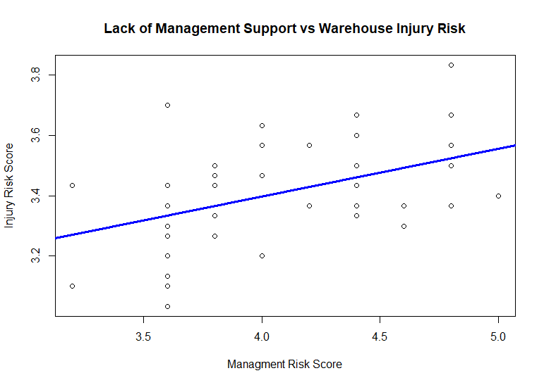
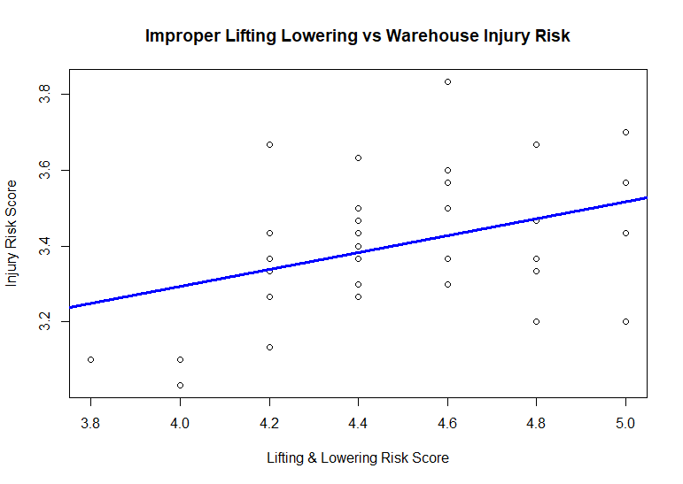
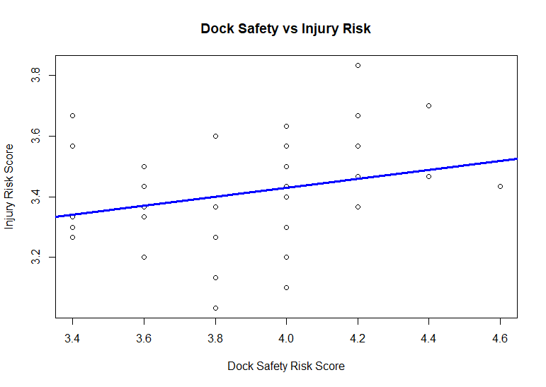

# Warehouse Workplace Safety Analysis Using Regression Modeling

## Project Overview

This project analyzes workplace safety factors associated with injuries in warehouse environments using statistical modeling and regression analysis in R.

The study was conducted as part of BAN 701: Business Analysis Methods at the University of Nevada, Reno. The objective was to identify workplace factors that contribute to injury risk among warehouse employees and package handlers.

Using survey data collected from warehouse workers, multiple regression and simple linear regression analyses were performed to evaluate the relationship between workplace safety practices and injury risk.

---

# Research Question

What workplace safety factors are most strongly associated with warehouse injury risk?

---

# Objectives

* Identify workplace safety factors that contribute to injuries
* Evaluate the relationship between safety practices and injury risk
* Apply regression analysis techniques using R
* Interpret statistical findings for business decision-making
* Visualize relationships using trendline analysis

---

# Research Categories

The study examined five major workplace safety categories:

* Management Support
* Dock Safety
* Lifting and Lowering Practices
* Operational Equipment
* Hazardous Materials

Each category was measured using multiple survey questions rated on a 1–5 scale.

---

# Methodology

## Data Collection

Survey responses were collected from warehouse associates and package handlers.

Participants rated workplace safety conditions using a Likert scale ranging from 1 (low risk) to 5 (high risk).

## Statistical Methods

The following analytical techniques were used:

* Multiple Linear Regression
* Simple Linear Regression
* Hypothesis Testing
* F-Tests
* Two-Tailed T-Tests
* Trendline Visualization

---

# Hypotheses

### H1

A low level of management support for implementing proper practices is positively associated with workplace injuries.

### H2

A low level of lifting and lowering practices is positively associated with workplace injuries.

### H3

A low level of dock safety practices is positively associated with workplace injuries.

---

# Key Findings

## Management Support

Management support showed the strongest relationship with injury risk.

Key findings:

* Significant positive relationship with injury risk
* Adjusted R² = 0.3369
* Positive regression coefficient
* Hypothesis accepted

Interpretation:

As management support decreases, workplace injury risk increases.

---

## Lifting and Lowering Practices

Lifting and lowering practices demonstrated a statistically significant positive relationship with injury risk.

Key findings:

* Significant positive relationship
* Adjusted R² = 0.1518
* Positive regression coefficient
* Hypothesis accepted

Interpretation:

Unsafe lifting practices increase the likelihood of workplace injuries.

---

## Dock Safety

Dock safety showed a positive but weaker relationship with injury risk.

Key findings:

* Positive regression coefficient
* Mixed statistical evidence
* Hypothesis not fully supported

Interpretation:

Additional research may be necessary to better understand the impact of dock safety on workplace injuries.

---

# Visualizations

## Management Support vs Warehouse Injury Risk

The positive trendline indicates that lower levels of management support are associated with higher workplace injury risk.

---

## Improper Lifting & Lowering vs Warehouse Injury Risk

The visualization demonstrates a positive relationship between unsafe lifting practices and injury risk.

---

## Dock Safety vs Injury Risk

The relationship between dock safety conditions and injury risk was positive but weaker than the relationships observed for management support and lifting practices.

---

# Tools & Technologies

* R Programming
* RStudio
* Linear Regression
* Statistical Analysis
* Data Visualization
* Business Analytics
* Hypothesis Testing

---

# Skills Demonstrated

* Data Cleaning
* Statistical Modeling
* Regression Analysis
* Data Visualization
* Analytical Reporting
* Business Analytics
* Workplace Safety Analytics
* Research Methodology

---

# Repository Contents

warehouse-safety-analysis/

README.md

charts/
dock_safety.png
lifting_lowering.png
management_support.png
README.md

data/
Ban 701 Assignment Project Data.xlsx
LiftingLoweringMean.xlsx
docksafety.xlsx
mgmtsupport.xlsx
README.md

docs/
Ban 701 Project Questionnaire.docx
Warehouse Safety Project.docx
README.md

scripts/
H1.R
H2.R
H3.R
README.md

## Folder Descriptions

### charts/
Contains regression visualizations and trendline analysis used to illustrate relationships between workplace safety factors and injury risk.

### data/
Contains the survey dataset and supporting Excel workbooks used for statistical analysis and hypothesis testing.

### docs/
Contains the survey questionnaire and final project report documenting the research methodology, analysis, findings, and conclusions.

### scripts/
Contains R scripts used to perform hypothesis testing, regression analysis, statistical calculations, and data visualization.

# Future Improvements

Potential future enhancements include:

* Interactive dashboards using Tableau
* Power BI reporting
* Predictive injury risk modeling
* Larger sample sizes
* Additional warehouse safety variables
* Machine learning classification models

---

# Author

Nathan Corpus

BAN 701 – Business Analysis Methods

University of Nevada, Reno
